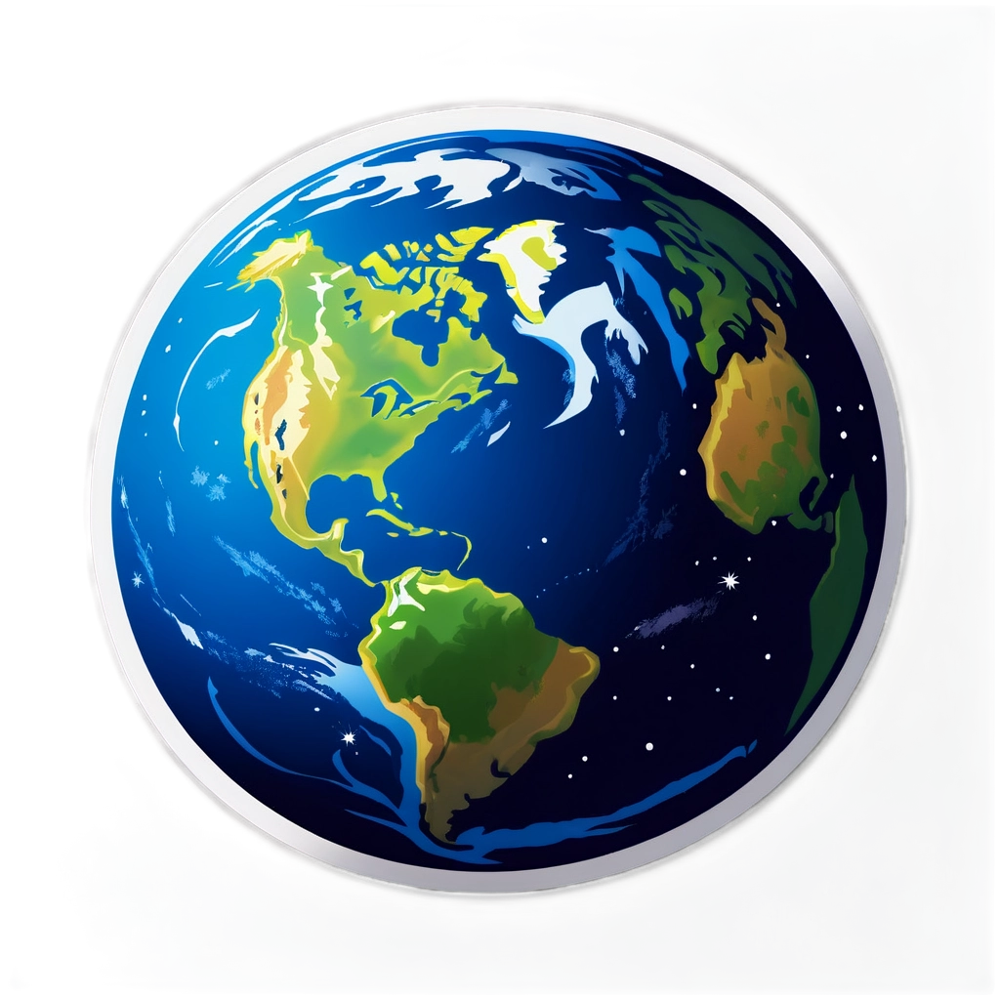

# 🛰️ FIRLY

**Earth's Night Lights from Space**

────

**Real-time satellite data** • **Interactive visualization** • **Global coverage**

────

────

────

*Visualizing humanity's light footprint*

